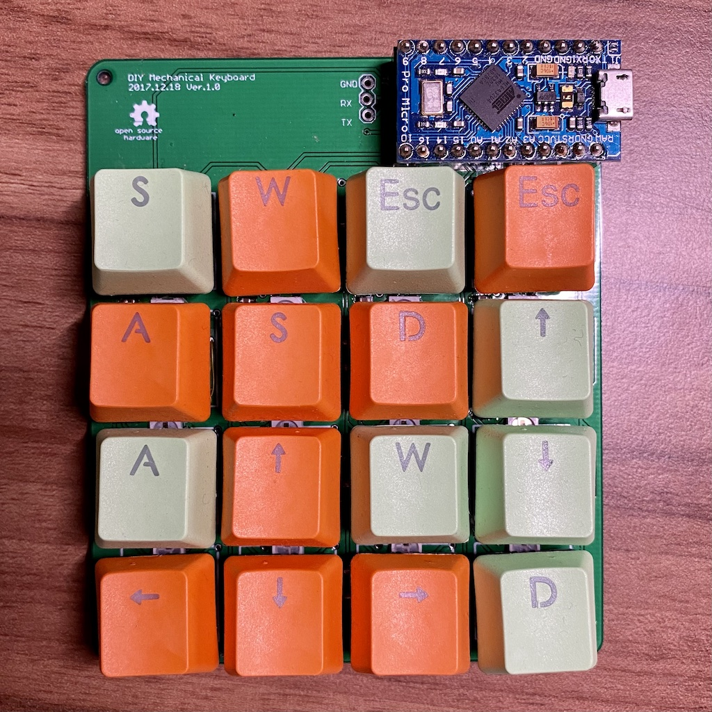

# Diy Mechanical Keyboard

### Hardware
- WS2812B NeoPixel: 없어도 동작함 [Link](https://www.adafruit.com/product/1655)
- 기계식 키스위치: http://www.coupang.com/vp/products/24294727

### Firmware
- MyDiyKbd: 실제 동작하는 코드
- Tets_Neopixel, Tets_Neopixel2, Test_key : 테스트용 코드

### Order
- 중국 PCB 업체 https://jlcpcb.com/

### 참고
- http://blog.komar.be/how-to-make-a-keyboard-the-matrix/
- 아두이노 Keyboard Modifiers https://www.arduino.cc/en/Reference/KeyboardModifiers
- Mac 키보드 단축키 https://support.apple.com/ko-kr/HT201236

